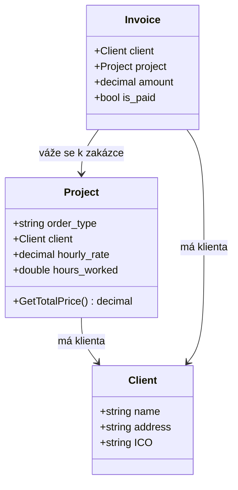

# FREELANCE DESK

Konzolová aplikace v jazyce **C# – jednoduchý informační systém pro evidenci
**klientů, zakázek a faktur** freelancera. Data se ukládají do souborů,
takže zůstávají zachována mezi jednotlivými spuštěními.

---

## Obsah

1. [Zadání projektu](#zadání-projektu)
2. [Model tříd a jejich vazby](#model-tříd-a-jejich-vazby)
3. [Struktura aplikace](#struktura-aplikace)
4. [Práce se soubory](#práce-se-soubory)
5. [Ovládání](#ovládání)
6. [Spuštění](#spuštění)

---

## Zadání projektu

Závěrečný projekt z předmětu **Programování (C#)**. Zadané podmínky:

- Projekt je vypracován v jazyce C# a využívá principy **objektově orientovaného programování (OOP)**.
- V programu jsou použity **dynamické kolekce**.
- Program **načítá a ukládá data ze souborů**.
- Téma si volí autor sám (po schválení vyučujícím).

**Zvolené téma – FREELANCE DESK:** informační systém, který pomáhá freelancerovi spravovat:

- **klienty** – jméno / název firmy, adresa, IČO,
- **zakázky** přiřazené ke konkrétnímu klientovi – typ práce, hodinová sazba, odpracované hodiny,
- **faktury** vystavené za zakázky – vyfakturovaná částka a stav (zaplaceno / nezaplaceno).

Naplnění podmínek zadání:

| Podmínka | Jak je splněna |
|----------|----------------|
| OOP | Tři datové třídy (`Client`, `Project`, `Invoice`) s vlastnostmi, konstruktory a metodou; využití kompozice (faktura obsahuje klienta i zakázku). |
| Dynamické kolekce | `List<Client>`, `List<Project>`, `List<Invoice>` a dočasné filtrované seznamy. |
| Práce se soubory | Ukládání a načítání všech dat ve formátu JSON (`clients.json`, `projects.json`, `invoices.json`). |

---

## Model tříd a jejich vazby



**Slovní popis vazeb:**

- **Client** – základní subjekt (odběratel). Sám na nic neodkazuje.
- **Project** (zakázka) – patří vždy **jednomu klientovi** (drží odkaz na `Client`).
  Umí spočítat svou cenu metodou `GetTotalPrice()` = `hourly_rate × hours_worked`.
- **Invoice** (faktura) – vystavuje se za **jednu konkrétní zakázku** **jednoho klienta**,
  proto drží odkaz na `Client` i na `Project`. Navíc nese vyfakturovanou částku (`amount`)
  a příznak zaplacení (`is_paid`).

Vztahy jsou tedy: `Invoice → Project → Client` a zároveň `Invoice → Client`.

---

## Struktura aplikace

### Třídy (soubory)

| Soubor | Účel | Klíčové prvky |
|--------|------|---------------|
| `Client.cs` | Datový model klienta | `name`, `address`, `ICO`; bezparametrový konstruktor (pro načítání z JSON) + plný konstruktor |
| `Project.cs` | Datový model zakázky | `order_type`, `client`, `hourly_rate`, `hours_worked`; metoda `GetTotalPrice()`; oba konstruktory |
| `Invoice.cs` | Datový model faktury | `client`, `project`, `amount`, `is_paid`; oba konstruktory |
| `Program.cs` | Vstupní bod a veškerá logika | hlavní smyčka, menu, správa entit, ukládání a načítání |

### Metody (`Program.cs`)

| Metoda | Popis |
|--------|-------|
| `Main()` | Vstupní bod programu. Načte data ze souborů, vykreslí úvodní obrazovku a spustí hlavní smyčku menu. |
| `Menu(title, clear, params choices)` | Univerzální menu ovládané šipkami. Vrací **index** vybrané položky. Používá se v celé aplikaci. |
| `ManageClients(clients, projects, invoices)` | Podmenu **Správa klientů** – výpis, přidání a odstranění klienta. |
| `ManageProjects(clients, projects)` | Podmenu **Správa zakázek** – výpis, vytvoření, zápis odpracovaných hodin, odstranění. |
| `ManageInvoices(invoices, projects, clients)` | Podmenu **Správa faktur** – výpis, vystavení, změna stavu, výpis nezaplacených, odstranění, statistiky. |
| `SaveClients(clients)` | Uloží seznam klientů do `clients.json`. |
| `SaveProjects(projects)` | Uloží seznam zakázek do `projects.json`. |
| `SaveInvoices(invoices)` | Uloží seznam faktur do `invoices.json`. |
| `LoadData(clients, projects, invoices)` | Při startu načte všechny tři JSON soubory do příslušných seznamů. |
| `Input_verification_ico(min, max)` | Načte a ověří IČO (pouze číslice, délka v rozsahu `min`–`max`). Vrací `string`. |
| `Input_verification_int(min)` | Načte a ověří celé číslo (≥ `min`). |
| `Input_verification_double(min)` | Načte a ověří desetinné číslo `double` (≥ `min`). |
| `Input_verification_decimal(min)` | Načte a ověří desetinné číslo `decimal` (≥ `min`). |

### Struktura menu

```
Hlavní menu
├── Správa klientů
│   ├── Vypsat všechny klienty
│   ├── Přidat nového klienta          (kontrola duplicit názvu i IČO)
│   ├── Odstranit klienta              (varuje při nezaplacené faktuře; smaže i jeho zakázky a faktury)
│   └── Zpět do hlavního menu
├── Správa zakázek
│   ├── Vypsat všechny zakázky
│   ├── Vytvořit novou zakázku         (přiřadí se ke klientovi, hodiny začínají na 0)
│   ├── Zapsat odpracované hodiny k zakázce
│   ├── Odstranit zakázku
│   └── Zpět do hlavního menu
└── Správa faktur
    ├── Vypsat všechny faktury
    ├── Vystavit novou fakturu         (hlídá, že zakázka nebyla vyfakturována dvakrát)
    ├── Změnit stav faktury            (přepíná zaplaceno / nezaplaceno)
    ├── Zobrazit nezaplacené faktury
    ├── Odstranit fakturu
    ├── Zobrazit souhrnné statistiky   (počty a hodnoty zaplacených / nezaplacených faktur)
    └── Zpět do hlavního menu
```

---

## Práce se soubory

- **Formát:** JSON, knihovna `System.Text.Json`. Ukládá se s odsazením
  (`WriteIndented = true`), aby byly soubory čitelné.
- **Tři soubory** (každý drží jeden seznam):
  - `clients.json` – klienti,
  - `projects.json` – zakázky,
  - `invoices.json` – faktury.
- **Umístění:** soubory se vytvoří automaticky v pracovním adresáři aplikace
  (vedle spustitelného souboru, typicky `bin/Debug/netX.0/`).
- **Ukládání:** probíhá **okamžitě po každé změně** dat (přidání, smazání, zápis hodin,
  změna stavu faktury) – příslušná `Save…` metoda serializuje celý seznam a přepíše svůj soubor.
- **Načítání:** jednou při startu aplikace metodou `LoadData`. Pokud soubor existuje,
  jeho obsah se deserializuje do odpovídajícího seznamu; pokud neexistuje, začíná se s prázdným seznamem.
- **Poznámka:** faktury a zakázky se ukládají včetně vnořených objektů – faktura v sobě nese
  i kopii klienta a zakázky, ke kterým patří.

---

## Ovládání

Aplikace se ovládá **z klávesnice**, primárně přes interaktivní menu:

- **Pohyb v menu:** šipky **↑ / ↓** (s přetočením – z první položky se skočí na poslední a naopak).
- **Potvrzení volby:** **Enter**.
- **Aktivní položka** je zvýrazněná (bílé pozadí, černý text, značka `>`).
  U faktur je stav navíc barevně odlišen – zeleně *zaplaceno*, červeně *nezaplaceno*.
- **Textové a číselné vstupy** (jméno, adresa, IČO, hodinová sazba, počet hodin) se
  zapisují z klávesnice a potvrzují **Enterem**. U číselných polí a IČO probíhá kontrola;
  při chybném zadání se vstup opakuje.
- **Návrat z obrazovky:** po dokončení akce se zobrazí výzva
  *„Stiskněte libovolnou klávesu pro návrat do menu"* – stiskem libovolné klávesy se vrátíte zpět.
- **Ukončení aplikace:** volbou **Konec** v hlavním menu.

---

## Spuštění

1. Otevřít projekt ve Visual Studiu (soubor `.sln`) nebo přeložit přes `dotnet build`.
2. Spustit (F5 ve Visual Studiu, nebo `dotnet run` v adresáři projektu).
3. Na úvodní obrazovce zvolit **START** a dále se pohybovat v menu.

> Projekt cílí na .NET s aktivovaným `ImplicitUsings` (výchozí nastavení moderní
> konzolové šablony .NET 6 a novější).
